# Workshop MicroPython

Voordat we aan de slag kunnen gaan met MicroPython moeten we eerst zorgen dat we kunnen inloggen op het bordje. Dit kan op verschillende manieren.

## Wemos D1 mini pin layout

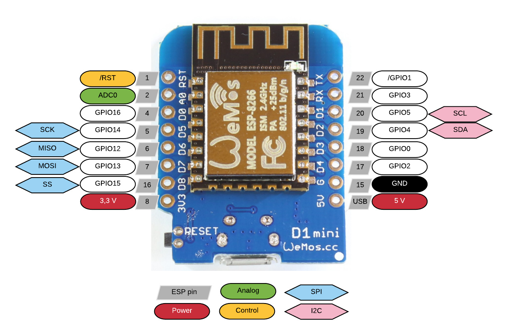

## MAC OS gebruikers

1. driver [downloaden](https://www.silabs.com/documents/public/software/Mac_OSX_VCP_Driver.zip) voor MAC OS
2. driver installeren, open de zip file, je ziet dan onderstaande files:
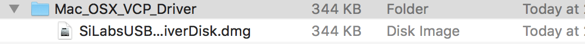
3. Klik vervolgens op de SiLabsUSB....dmg
4. Klik vervolgens op **"Agree"**
5. Vervolgens verschijnt het onderstaande screenshot:
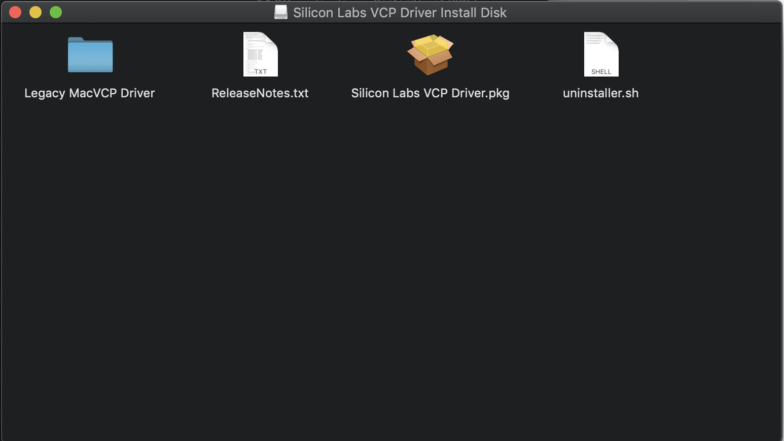
6. Klik vervolgens op de Silicon Labs VCP Driver.pkg
7. Druk constant op **"Continue"** tot het onderstaande screenshot:

8. Nu moet de mac opnieuwe opgestart worden.
> **Note:** Het kan zijn dat er een beveiligingswaarschuwing komt, de driver moet u uitzonderen in **"Security & Privacy"**.

9. Vervolgens kunt in de shell het volgende commando uitvoeren:

   ```screen /dev/tty.wchusbserial``` [vervolgens tab om automatisch te laten aanvullen] ```115200```

   Het commando ziet er ongeveer als volgt uit:

   ```screen /dev/tty.wchusbserial14610 115200```

 10. Je ziet in het scherm ```>>>``` staan. Dit betekend dat je verbinding hebt met het bordje.

## Windows gebruikers

1. driver [downloaden](https://www.silabs.com/products/development-tools/software/usb-to-uart-bridge-vcp-drivers) voor Windows OS
2. driver installeren, open de zip file, je ziet dan onderstaande map:

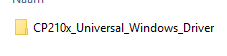

3. Kopieeer vervolgens de map ergens op je hardeschijf
3. Start vervolgens de exe, zie onderstaande afbeelding voor het bestandsnaam:


4. Klik vervolgens op **"Volgende"**

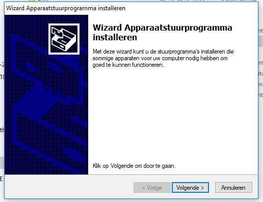

5. Vervolgens verschijnt het onderstaande screenshot:

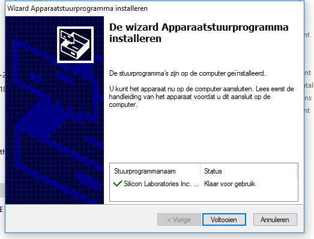

6. Reboot het systeem, en sluit daarna het bordje aan met de usb kabel.
7. Start vervolgens **Apparaatbeheer**. Klap vervolgens de com poorten uit om uit te zoeken op welke com poort het bordje is aangelosten. In dit geval com9.

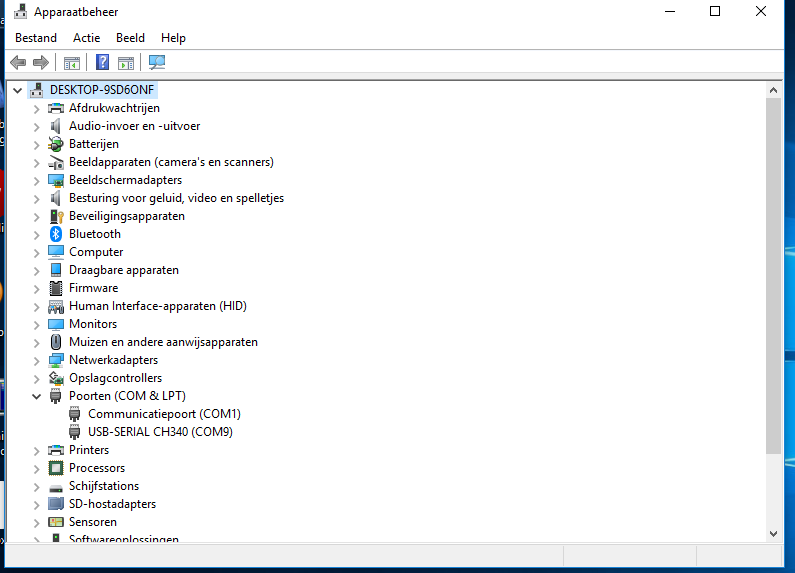

8. [Downloaden](https://the.earth.li/~sgtatham/putty/latest/w32/putty.exe) vervolgens putty, hiermee kunnen we een verbinding opzetten naar het bordje.
9. Start vervolgens putty en stel de onderstaande waardes in, zet bij compoort het jusit poortnummer in.

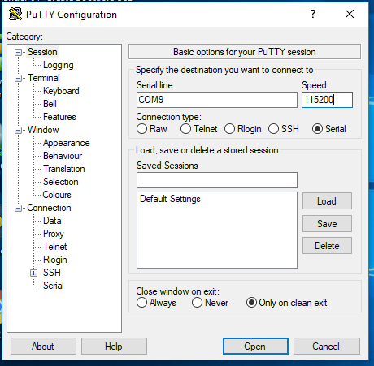

10. Klik vervolgens op openen, je ziet vervolgens een zwart scherm. Als je een paar keer op enter drukt zie je vervolgens ```>>>``` je hebt nu verbinding met het bordje.

> **Note:** Het kan zijn dat er een beveiligingswaarschuwing komt, de driver installatie moet u toestaan.


## Webrpl

Het is ook mogelijk om zonder driver het bordje te benaderen. Dit kan middels webrpl. Hiervoor moeten onderstaande stappen worden ondernomen.

 1. Download de [master.zip](https://github.com/micropython/webrepl/archive/master.zip) bestand.
 2. Pak vervolgens het zip bestand uit
 3. Open vervolgens het bestand webrepl.html in IE/Chrome/Firefox
 4. Maak vervolgens verbinding met Wifi naar MicroPython-[cijfersletters op gele briefje]
 5. De wifi code is **micropythoN**
 6. Na verbinding kun je vervolgens op de **Connect** knop klikken in de webpagina.
 7. Er wordt vervolgens gevraagd naar een wachtwoord, type hier in **ieni**
 8. Je ziet nu **>>>** dit betekend dat je verbinding hebt met het bordje

# Workshop 0 leren programmeren

Als we het over programmeren hebben, hebben we het eingelijk over het programmeren van algoritmes.

> "Een algoritme is een eindige reeks instructies die vanuit een gegeven begintoestand naar een beoogd doel leiden". Bron: wikipedia

Een computer programma is eigenlijk 1 groot algoritme, maar dan omgezet in een computerprogramma.

## python libraries
Python libraries zijn stukjes code/programma's die we kunnen aanroepen binnen onze eigen programma. Dit bespaard een hoop code, en zorgt tevens voor het succes van Python omdat veel libraries gedeeld worden waardoor iedereen elkaar helpt.

We kunnen Python libraries importeren met het commando import.

  ```import machine```
  (nu importeren wij alle wat in de library machine staat, niet wenselijk)

  ```from machine import Pin```
  (nu importeren wij alleen de module/class Pin van de machine library)

## Commando print
   ```print("Hallo wereld")```
   (Hiermee schrijven wij Hallo wereld op het scherm)

## Commando while
   ```while True:
        print("Hallo wereld")```
   (Hiermee creeeren wij een eindeloze lus die hallo wereld schrijft op het scherm ctr+c breken we de eindeloze lus af. Je zien na de dubbele punt dat we twee spaties doen voor print hiermee zeggen we tegen Python dat alle code waar twee spaties voor staan uitgevoerd moet worden (indend))


# Workshop 1 een ledje laten branden

Benodigd:

* Wit ledje
* Rood draadje
* Zwart draadje
* Weerstandje met kleuren bruin zwart bruin goud (100Ohm)
* Breadbordje met gaatjes
* Wemos bordje

1. zorg dat de kabeljes aangesloten is volgens het onderstaande voorbeeld
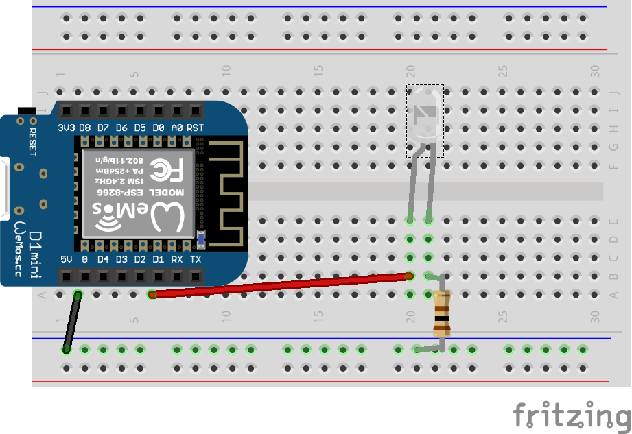

2. Type vervolgens na ```>>>``` de volgende regel in:

  ```
  from machine import Pin
  ```
  > Hiermee zorgen we dat de Pin module geladen wordt waardoor wij de pin kunnen aansturen van het bordje

  ```
  led = Pin(5, Pin.OUT)
  ```
  > Hiermee definieren wij **led** welke is aangesloten is op pin nummer 5, en dat het bordje stroom op het pinnetje moet gaan zetten.

  ```
  led.on()
  ```
  > Nu zeggen we tegen het bordje dat hij er stroom op het pinnetje moet gaan zetten.

  ```
  led.off()
  ```
  > Nu zeggen we tegen het bordje dat hij de stroom er vanaf moet gaan halen.

Zojuist hebben wij het eerste programma geschreven voor het bordje in Python. Niet zo moeilijk toch ;)


# Workshop 2 een zwaailichtje maken

Benodigd:

* 2x blauwe ledje
* Rood draadje
* Zwart draadje
* Geel draadje
* 2x Weerstandje met kleuren bruin zwart bruin goud (100Ohm)
* Breadbordje met gaatjes
* Wemos bordje

1. zorg dat de kabeljes aangesloten is volgens het onderstaande voorbeeld
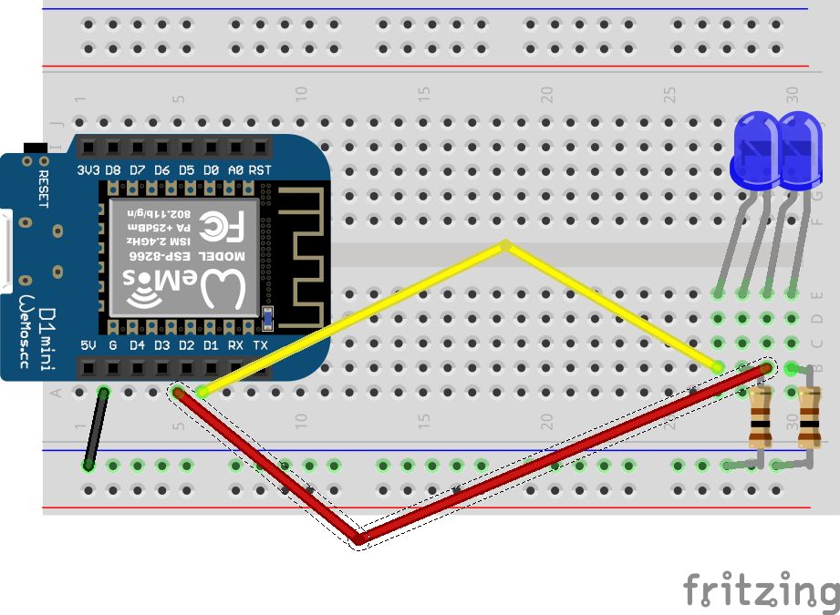

2. Type vervolgens na >>> de volgende regel in:

```
from machine import Pin
from time import sleep
```

> Hiermee zorgen we dat de Pin module geladen wordt waardoor wij de pin kunnen aansturen van het bordje. Daarnaast laden wij de module sleep in zodat we het programma even kunnen laten pauzeren.

```
led1 = Pin(4, Pin.OUT)
led2 = Pin(5, Pin.OUT)
```
> Hiermee definieren wij **led** welke is aangesloten is op pin nummer 4,5 en dat het bordje stroom op het pinnetjes moet gaan zetten.
```
while True:
  led1.on()
  led2.off()
  sleep(0.5)
  led1.off()
  led2.on()
  sleep(0.5)
```
> Na bovenstaande moet je een paar keer op enter drukken om uit de while loop te gaan. De code begin dan de while loop te starten.

> Je ziet hierboven dat weer eerst led1 aanzetten en led2 uit. Daarna wachten we een halve seconden, en daarna zetten wij led1 uit en vervolgens led2 aan en wachten we een aantal seconden. Omdat we dit willen herhalen in een eindeloze loop hebben wij dit in een while lus gezet (while True) betekend, wanneer waar, is altijd waar dus eindeloos. We kunnen de loop afbreken door ctrl+c breken we de while lus af

# Workshop 3 knopje met ledje

Benodigd:

* Geel ledje
* Zwart draadje
* Bruin draadje
* Groen draadje
* Blauw draadje
* Weerstandje met kleuren bruin zwart bruin goud (100Ohm)
* Breadbordje met gaatjes
* Wemos bordje

1. zorg dat de kabeljes aangesloten is volgens het onderstaande voorbeeld
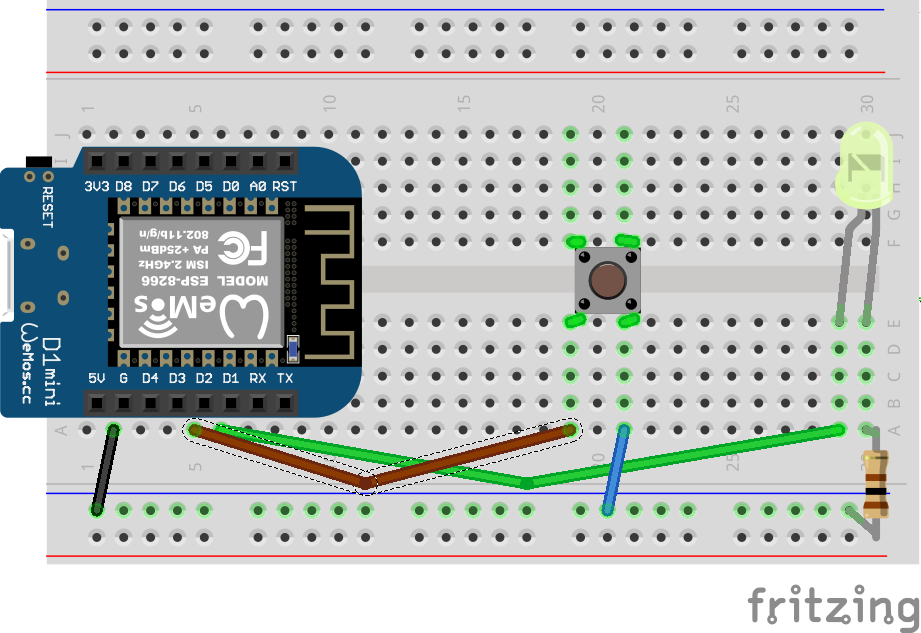

2. Type vervolgens na >>> de volgende regel in:
```
from machine import Pin
```
> We importeren eerst de Pin library.

```
led = Pin(5, Pin.OUT)
button = Pin(4, Pin.IN, Pin.PULL_UP)
```
> Vervolgens definieren wij dat de led aangesloten is op pin 5. Maar we definieren vervolgens ook dat de button aangesloten op pin 4. Omdat dit geen output maar een input device is geven wij Pin.IN i.p.v. Pin.OUT op. Daarnaast geven wij aan dat we een trigger willen hebben wanneer de knop los gelaten wordt (Pin.PULL_UP).

```
while True:
  if button.value():
    led.off()
  else:
    led.on()
```
> Ook hier willen wij gebruik maken van een eindeloze loop. Echter zie je hier staan **if button.value()** Dit betekend wanneer de knop ingedrukt wordt dat button.value() een waarde 1 heeft hij een actie moet doen, namelijk het ledje uit zetten. Als **button.value()** geen waarde heeft, dan moet het ledje aangezet worden.

# Workshop 4 een stoplichtje maken

Benodigd:

* 2x rood ledje
* 2x oranje ledje
* 2x groen ledje
* Alle kleuren draadjes
* 6x Weerstandje met kleuren bruin zwart bruin goud (100Ohm)
* 1x Weerstandje met kleuren bruin zwart oranje goud (10KOhm)
* Breadbordje met gaatjes
* Wemos bordje

1. zorg dat de kabeljes aangesloten is volgens het onderstaande voorbeeld
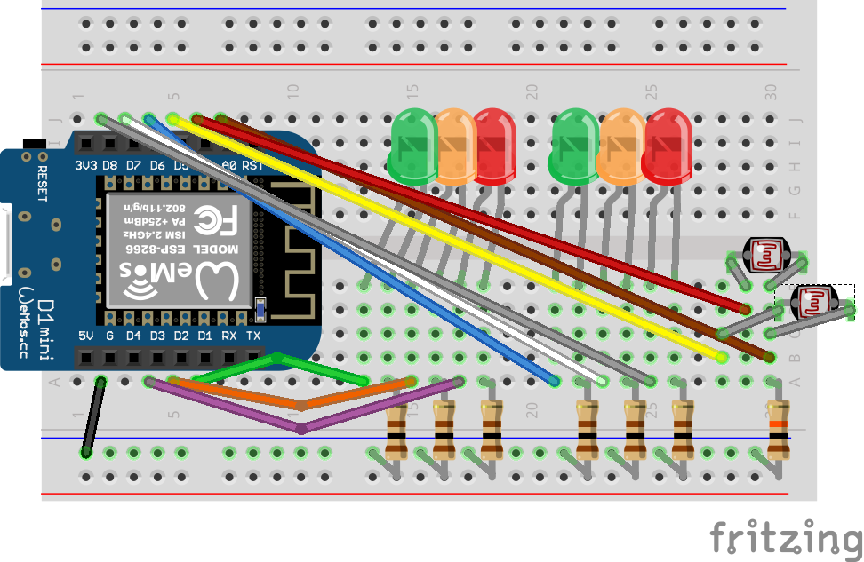

```
from machine import Pin
from machine import ADC
from time import sleep
```
> Hierboven laden wij 3 modules. Zoals je ziet is er een extra module bijgekopen, namelijk ADC. Met de module ADC kunnen we namelijk op de analoge poort meten hoeveel stroom er in gaat. Hiermee kunnen we bepalen wat de lichtsterkte is.

```
lichtsterkte = ADC(0)
```
> Hierboven geven we aan op welke poort hij de stroom moet gaan meten. Dit bordje heeft echter maar 1 analoge poort, namelijk 0. Dus geven we hier 0 op.

```
sensor1 = Pin(16, Pin.OUT)
sensor2 = Pin(14, Pin.OUT)
rood1 = Pin(15, Pin.OUT)
oranje1 = Pin(13, Pin.OUT)
groen1 = Pin(12, Pin.OUT)
rood2 = Pin(0, Pin.OUT)
oranje2 = Pin(4, Pin.OUT)
groen2 = Pin(5, Pin.OUT)
```
> Hierboven definieren wij de sensoren en ledjes op welke poort deze zitten.

```
while True:
  sensor1.off()
  sensor2.off()
  rood1.on()
  rood2.on()
  sleep(1)

  # Check of een auto staat op sensor1
  sensor1.on()
  if lichtsterkte.read() < 300:
    rood1.off()
    groen1.on()
    sleep(5)
    groen1.off()
    oranje1.on()
    sleep(1)
    oranje1.off()
    rood1.on()
  sensor1.off()

  # Check of een auto staat op sensor2
  sensor2.on()
  if lichtsterkte.read() < 300:
    rood2.off()
    groen2.on()
    sleep(5)
    groen2.off()
    oranje2.on()
    sleep(1)
    oranje2.off()
    rood2.on()
  sensor2.off()
```
> Eerst starten wij een eindeloze lus op, daarnaa zorgen we dat er door beide sensoren (LDR's) geen stroom loopt, en zorgen wij dat beide verkeerslichten op rood staan. Daarna zetten we de eerste sensor aan, hierdoor gaat er een stroom lopen door de sensor waardoor de lichtsterkte gemeten kan worden.  Hiermee simuleren wij of er een auto staat te wachten op de sensor. Want als er schaduw gesingaleerd wordt weten we dat er een auto staat te wachten. Hierdoor zetten we het verkeerlicht op groen. We wachten 5 seconden en zetten deze vervolgens op oranje en daarna op rood. Hierna kijken we bij sensor2 of er een auto staat te wachten en doen hier vervolgens de zelfde stappen.
